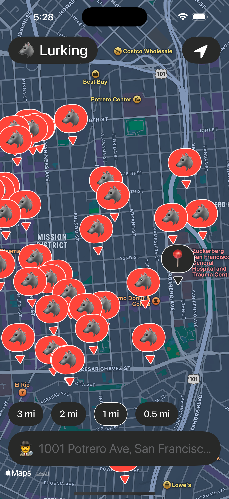

# Lurking 🧭📍

**A Gen-Z-style iOS app that maps nearby registered offenders using real-time location and address search.**

Lurking helps users visualize public safety data from the U.S. National Offender Registry. It’s built with a clean, mobile-native UI designed for quick lookup, casual browsing, and real-world usefulness.

[→ Download on the App Store](https://apps.apple.com/us/app/lurking/id6742218032)

---

## 🖼️ Screenshots

### 🔍 Address Search Feature  

---

## 🔍 Features

- 🗺️ **Live Map View** – Automatically shows registered offenders near your current location  
- 📬 **Address Search** – Look up any U.S. address to search by location  
- 🧃 **Gen-Z UI Style** – Playful, swipe-friendly SwiftUI interface built for modern iPhone users  
- 🔌 **Custom Node.js API** – Efficiently pulls and caches data from the U.S. National Offender Registry  

---

## 🧰 Tech Stack

- `SwiftUI` – iOS front end  
- `Node.js + Express` – Backend API server  
- `MapKit` – Real-time pin rendering  
- `Geocoding APIs` – Converts addresses and GPS into location-based queries  

---

## ⚙️ How It Works

- User location is requested and used to query the backend API  
- The API fetches and filters offender data within a defined radius  
- Pins are rendered on the map with relevant info on tap  
- Search input triggers a similar process based on address instead of GPS  

---

## 💡 Why I Built This

I wanted to explore:  
- Government data + geospatial processing  
- Building a map-first UX in SwiftUI  
- Projects with real-world relevance that push product boundaries  

As a solo developer, I enjoy taking projects from idea to shipped App Store product. Lurking is one of 5+ iOS apps I’ve built and launched independently.

---

## ⚠️ Data Disclaimer

This app uses publicly available data from the U.S. National Offender Registry. It is provided for informational purposes only. Accuracy depends on third-party source quality.

---

## 👋 About Me

I'm **Tim Gremp** — a product-focused iOS dev and former CPA. I love building tools that solve real problems. Whether it’s mobile UX, backend APIs, or full-stack MVPs, I’m focused on shipping fast, clear, and useful products.

- [🔗 LinkedIn](https://www.linkedin.com/in/tim-gremp-26bb2090/)  
- [📱 Lurking on the App Store](https://apps.apple.com/us/app/lurking/id6742218032)

---

*Thanks for checking it out. Feel free to reach out if you'd like to connect!*
